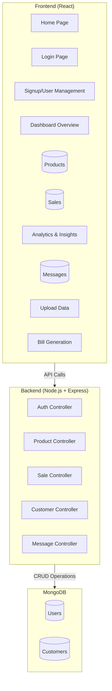
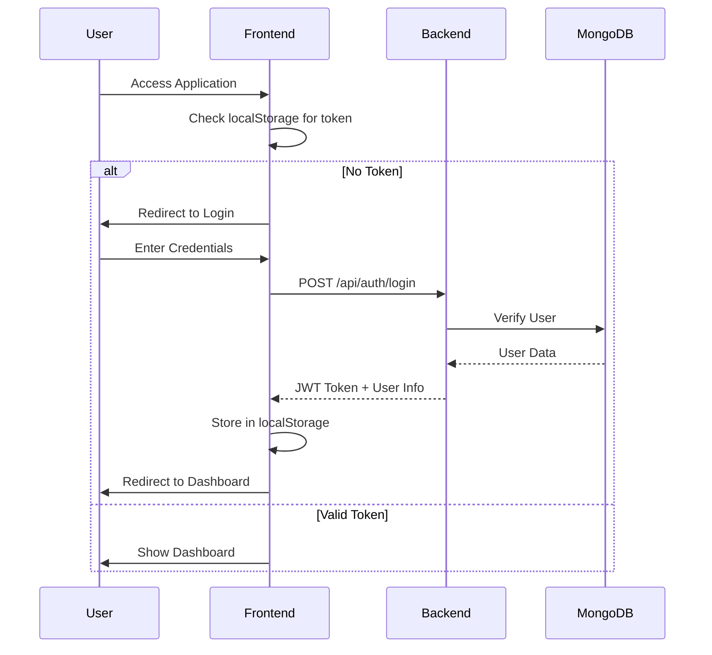
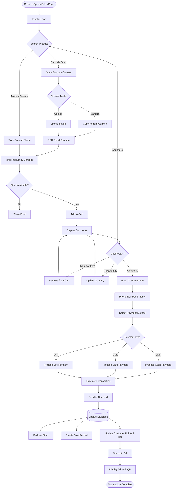
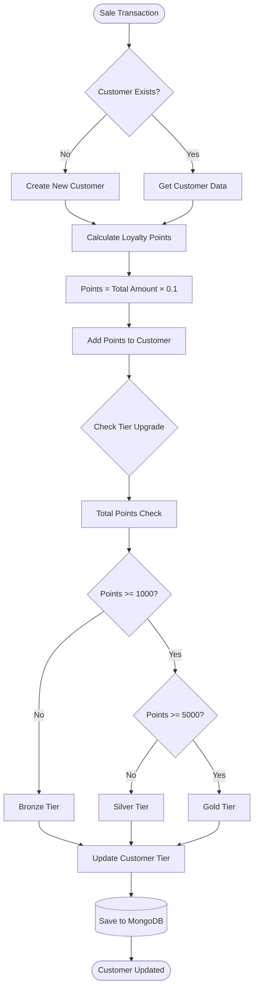
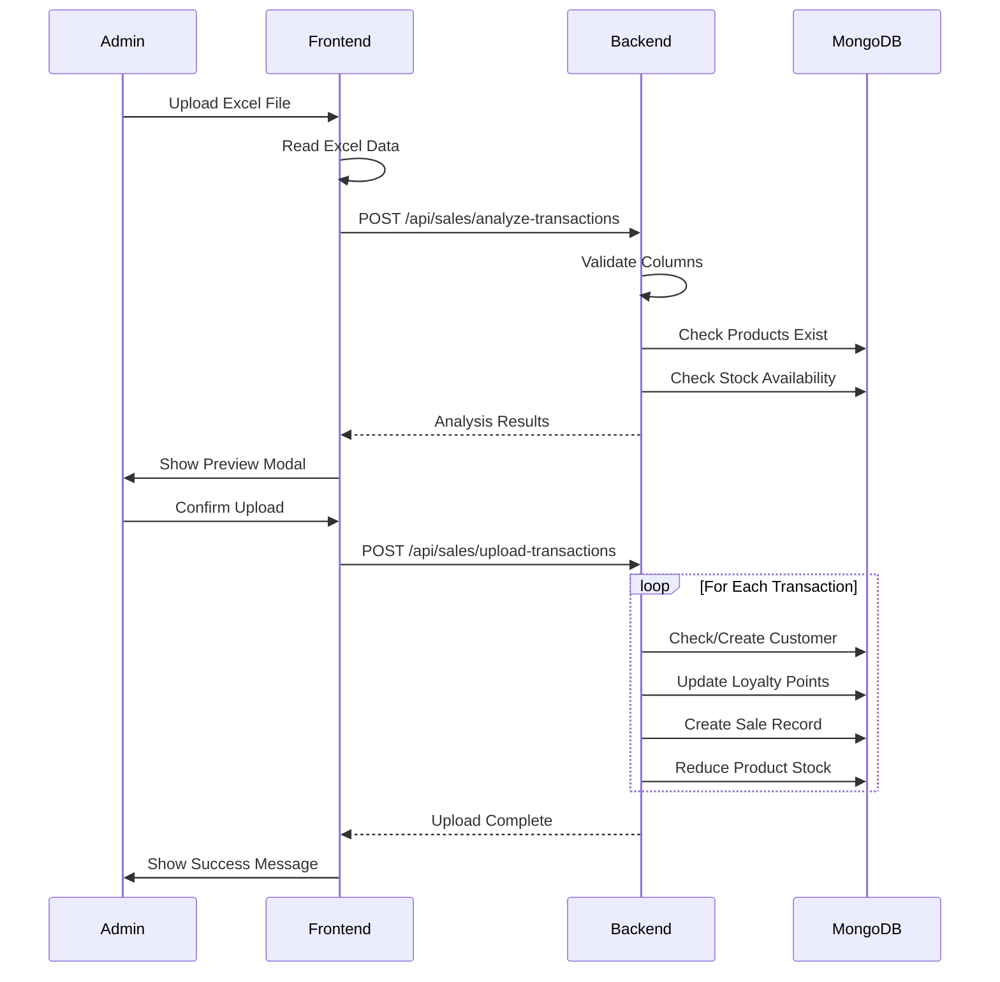
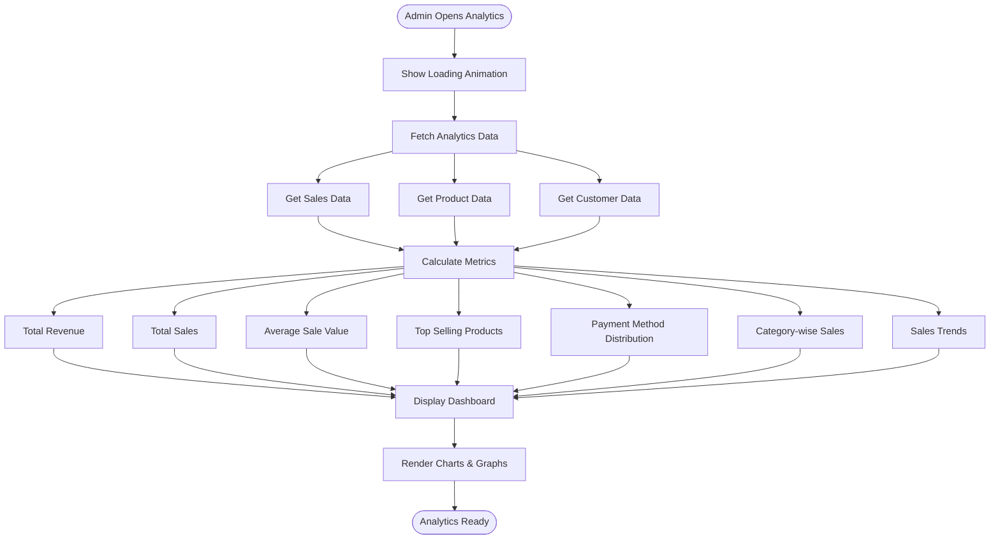
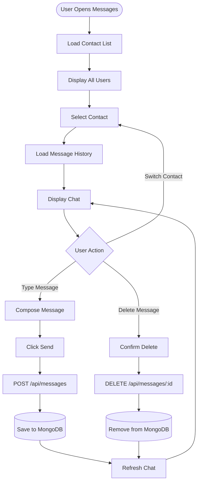
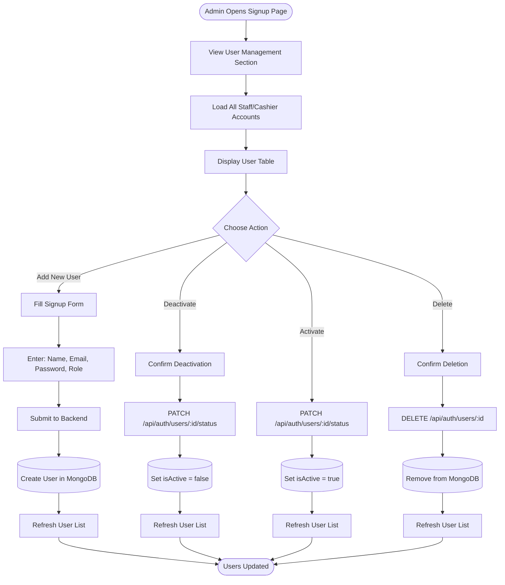
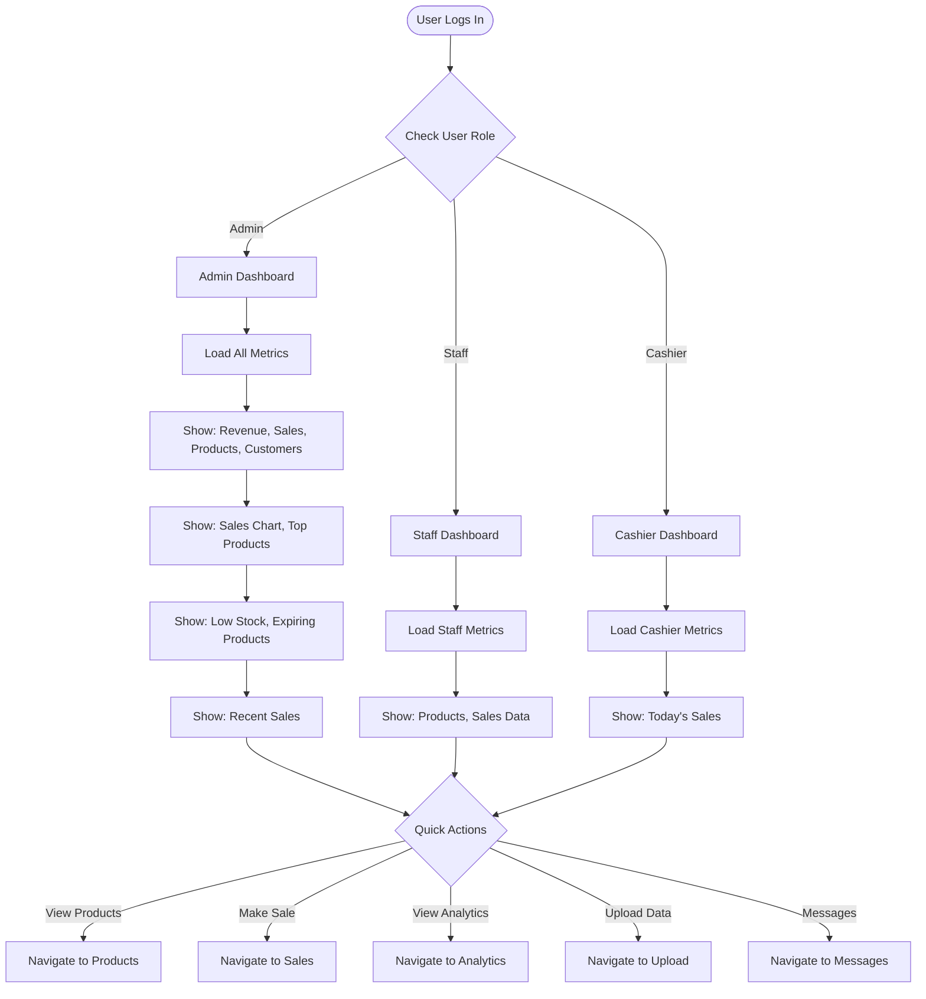

# Supermarket POS System - Flow Diagrams

## 1. System Architecture Overview

## 2. User Authentication Flow

## 3. Product Management Flow

```mermaid
flowchart TD
    Start([Admin/Staff Access Products Page]) --> View[View All Products]
    View --> Filter{Apply Filters?}
    Filter -->|All Products| ShowAll[Display All]
    Filter -->|Expiring Soon| ShowExpiring[Display Expiring Products]
    Filter -->|Expired| ShowExpired[Display Expired Products]
    
    View --> Action{Choose Action}
    Action -->|Add New| AddForm[Fill Product Form]
    AddForm --> AddDetails[Enter: Name, Barcode, Price, Stock, Category, Expiry]
    AddDetails --> Submit1[Submit to Backend]
    Submit1 --> DB1[(Save to MongoDB)]
    DB1 --> Refresh1[Refresh Product List]
    
    Action -->|Edit| EditForm[Modify Product Details]
    EditForm --> Submit2[Update Backend]
    Submit2 --> DB2[(Update MongoDB)]
    DB2 --> Refresh2[Refresh Product List]
    
    Action -->|Delete| Confirm[Confirm Deletion]
    Confirm --> Submit3[Delete Request]
    Submit3 --> DB3[(Remove from MongoDB)]
    DB3 --> Refresh3[Refresh Product List]
    
    Refresh1 --> End([Products Updated])
    Refresh2 --> End
    Refresh3 --> End
```

## 4. POS/Sales Transaction Flow

## 5. Customer Loyalty System Flow

## 6. Bulk Data Upload Flow

## 7. Analytics & Insights Flow

## 8. Messaging System Flow

## 9. User Management Flow (Admin Only)

## 10. Dashboard Overview Flow

## Key Features Summary

### Authentication & Authorization
- JWT-based authentication
- Role-based access control (Admin, Staff, Cashier)
- Protected routes

### Product Management
- CRUD operations
- Barcode scanning (OCR)
- Stock tracking
- Expiry date monitoring
- Category management
- Discount/offer system

### Sales/POS System
- Real-time product search
- Barcode scanning (camera/upload)
- Cart management
- Multiple payment methods (cash, card, UPI)
- Customer tracking
- Bill generation with QR code

### Customer Relationship Management
- Customer profiles
- Loyalty points system
- Tier-based rewards (Bronze, Silver, Gold)
- Purchase history

### Analytics & Reporting
- Revenue tracking
- Sales trends
- Top products analysis
- Payment method distribution
- Category-wise performance
- Custom date range filtering

### Bulk Data Operations
- Excel file upload
- Transaction import
- Data validation
- Preview before commit

### Communication
- Internal messaging system
- User-to-user chat
- Message history

### User Management
- Add/edit/delete users
- Activate/deactivate accounts
- Role assignment
- Staff monitoring
